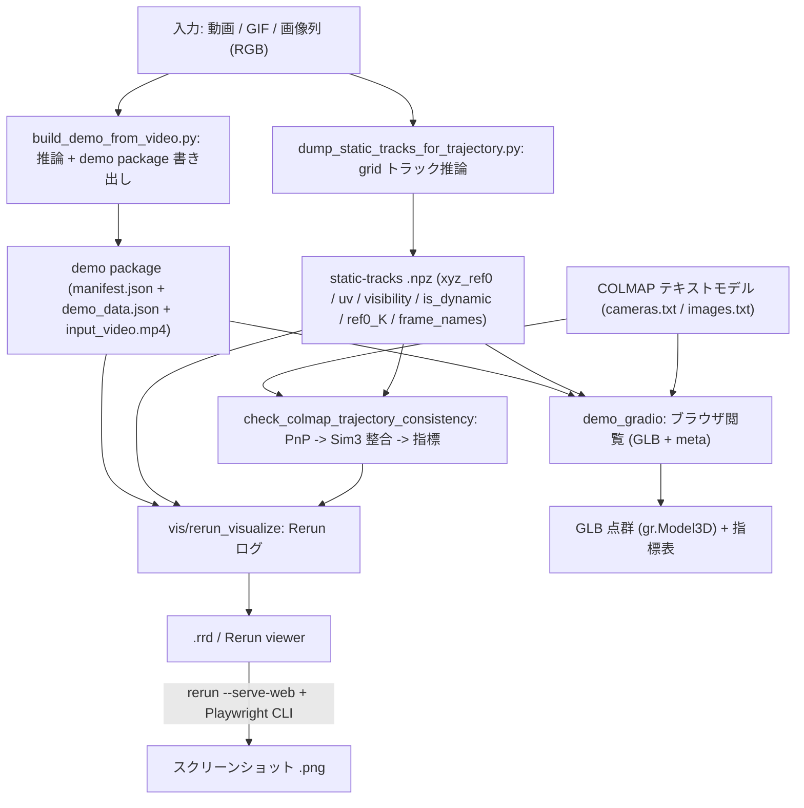
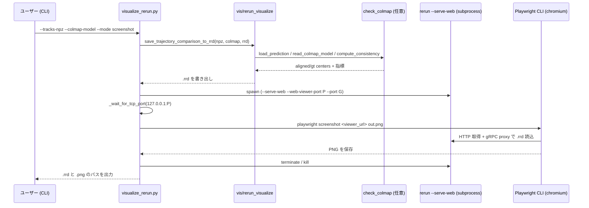
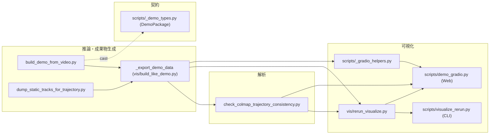
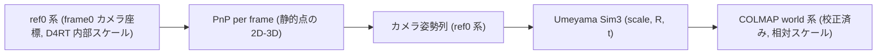

# D4RT 推論結果 可視化パイプライン 概要

**作成日**: 2026-06-11
**対象プロジェクト**: OpenD4RT (`yuki-inaho/Open-d4rt`)
**対象モジュール/システム**: ローカル推論成果物の可視化サブシステム(demo package 生成 / static-tracks ダンプ / COLMAP 軌跡一致性 / Rerun・Gradio ビューア)
**調査範囲**: `scripts/build_demo_from_video.py`, `scripts/dump_static_tracks_for_trajectory.py`, `scripts/check_colmap_trajectory_consistency.py`, `scripts/_demo_types.py`, `vis/rerun_visualize.py`, `scripts/visualize_rerun.py`, `scripts/_gradio_helpers.py`, `scripts/demo_gradio.py`, 依存元 `vis/build_like_demo.py`

---

## 目次
1. [エグゼクティブサマリー](#1-エグゼクティブサマリー)
2. [目的と位置づけ](#2-目的と位置づけ)
3. [処理コンセプト](#3-処理コンセプト)
4. [処理フロー（flowchart）](#4-処理フローflowchart)
5. [シーケンス図（sequenceDiagram）](#5-シーケンス図sequencediagram)
6. [コンポーネント/コンテナ図](#6-コンポーネントコンテナ図)
7. [依存関係マトリクス](#7-依存関係マトリクス)
8. [主要コンポーネント](#8-主要コンポーネント)
9. [入出力データ仕様](#9-入出力データ仕様)
10. [座標系/単位/変換フロー](#10-座標系単位変換フロー)
11. [主要パラメータ/設定](#11-主要パラメータ設定)
12. [技術詳細とコード解説](#12-技術詳細とコード解説)
13. [擬似コード](#13-擬似コード)
14. [性能特性/ボトルネック](#14-性能特性ボトルネック)
15. [トラブルシューティング](#15-トラブルシューティング)
16. [拡張性の設計方針](#16-拡張性の設計方針)
17. [検証・テスト](#17-検証テスト)
18. [差分・既知のリスク](#18-差分既知のリスク)
19. [未確定事項](#19-未確定事項)
20. [参考資料](#20-参考資料)
21. [ユーザー指摘・ギャップ・学び](#21-ユーザー指摘ギャップ学び)
22. [プリベイク運用（静的結果ビューワ）](#22-プリベイク運用静的結果ビューワ)

---

## 1. エグゼクティブサマリー

### 1.1 目的
D4RT モデルの**推論結果**(点群・2Dトラック・カメラ内部パラメータ・動的マスク)を、GUI のないヘッドレス環境でもブラウザでも確認できるようにする可視化サブシステム。3 種の成果物 — (A) demo package、(B) static-tracks npz、(C) COLMAP 軌跡一致性 — を、**Rerun**(`.rrd`/Web/スクリーンショット)と **Gradio**(GLB点群 + 指標表)で可視化する。

### 1.2 主要発見事項
| 項目 | 発見事項 | 影響 |
|---|---|---|
| カメラ姿勢の非出力 | この D4RT 実装は `pred_camera_* = None` を返し、カメラ軌跡を直接出力しない (`vis/build_like_demo.py:1778`) | 軌跡可視化は「静的点の2D-3D対応からPnPで導出」する設計に帰結 |
| `point_uv_px` は静的 | `point_uv_px` はクエリ格子のタイルで各フレーム不変 (`vis/build_like_demo.py:1602`) | PnP には**動く** `track_uv_px`(grid トラック)を使う必要がある |
| ヘッドレス可視化 | Rerun `.rrd` 出力 + `rerun --serve-web` + Playwright CLI でスクショ取得が成立(本環境で実証) | ディスプレイ無しの Desktop でも結果確認が可能 |

---

## 2. 目的と位置づけ
- **前工程**: D4RT 推論。入力は動画/GIF または画像ディレクトリ(COLMAP 登録フレーム)。モデルは `checkpoints/OpenD4RT_48CLIP_9Mix_NoCropAUG/{model.yaml,opend4rt.ckpt}`。
- **本処理の役割**: 推論結果を「人間が見て妥当性を判断できる形」(3Dビューア・GLB・定量指標)に変換する。さらに COLMAP の幾何(校正済み再構成)との**一致性チェック**を提供する。
- **後工程**: 研究者の目視評価・デバッグ・回帰確認。定量評価(WorldTrack)とは分離(本サブシステムは動作確認・可視化用)。

---

## 3. 処理コンセプト
- **入力**: 動画/GIF/画像列(RGB)、D4RT checkpoint + config、(任意で)COLMAP テキストモデル。
- **出力**: demo package(`manifest.json` + `assets/demo_data.json` + `input_video.mp4` + poster)、static-tracks `.npz`、Rerun `.rrd`、スクリーンショット `.png`、GLB 点群、軌跡指標 JSON。
- **中核ロジック**:
  1. `_export_demo_data` で点群(per-frame 3D)・トラック(動く2D+3D)・動的マスク・`ref0_K` を推論 (`vis/build_like_demo.py:1567`)。
  2. 軌跡: **静的点のみ**で `cv2.solvePnP` → 各フレームのカメラ姿勢を ref0 系で復元 → COLMAP 軌跡へ **Umeyama Sim3** 整合 → ATE/RPE/回転/スケール (`scripts/check_colmap_trajectory_consistency.py:353`)。
  3. Rerun/Gradio で 3D + 2D + 指標を提示。
- **重要な前提**: 静的点の `xyz_ref0` はフレーム間でほぼ不変(ref0 = フレーム0カメラ系の固定参照)。COLMAP モデルは姿勢推定済み(text 形式 `cameras.txt`/`images.txt`)。

---

## 4. 処理フロー（flowchart）



---

## 5. シーケンス図（sequenceDiagram）

`scripts/visualize_rerun.py --mode screenshot` の実行系列(ヘッドレス・スクリーンショット)。



---

## 6. コンポーネント/コンテナ図



---

## 7. 依存関係マトリクス

| コンポーネント | 依存先 | 被依存/呼び出し元 | 備考 |
|---|---|---|---|
| `vis/rerun_visualize.py` | `rerun`, `cv2`, `check_colmap_trajectory_consistency`(遅延 import) | `scripts/visualize_rerun.py`, `scripts/demo_gradio.py` | 軌跡経路で checker を再利用(DRY) |
| `scripts/visualize_rerun.py` | `vis/rerun_visualize`, `rerun` CLI, `playwright` CLI | CLI 利用者 | screenshot で subprocess 起動 |
| `scripts/check_colmap_trajectory_consistency.py` | `cv2`(PnP), `numpy` | `vis/rerun_visualize`, `scripts/demo_gradio` | scipy/pycolmap 不使用 |
| `scripts/_gradio_helpers.py` | `trimesh`, `numpy` | `scripts/demo_gradio.py` | GLB 生成(scipy 回避) |
| `scripts/demo_gradio.py` | `gradio`, `_gradio_helpers`, `vis/rerun_visualize`, `check_colmap` | Web 利用者 | 127.0.0.1 既定 |
| `scripts/build_demo_from_video.py` | `vis/build_like_demo`, `infer_track_3d`, `src.*`, `_demo_types` | 利用者・テスト | demo package の producer |
| `scripts/dump_static_tracks_for_trajectory.py` | `vis/build_like_demo._export_demo_data`, `build_demo_from_video._build_inference_model` | 利用者 | grid トラック推論 |
| `scripts/_demo_types.py` | `jaxtyping`, `numpy` | `build_demo_from_video` | 形状契約の単一情報源 |

---

## 8. 主要コンポーネント

| コンポーネント | 種別 | 役割 | 主な参照ファイル | 参照コード |
|---|---|---|---|---|
| `build_demo_from_video.main` | スクリプト | 動画/GIF→推論→demo package 出力 | `scripts/build_demo_from_video.py` | `scripts/build_demo_from_video.py:424` |
| `_write_demo_package` / `_build_demo_data_json` | 関数 | demo_data.json + manifest + 動画資産の書き出し | 同上 | `scripts/build_demo_from_video.py:349`, `:289` |
| `DemoPackage` | 型(TypedDict) | demo package 配列の形状契約 | `scripts/_demo_types.py` | `scripts/_demo_types.py:44` |
| `dump_static_tracks_for_trajectory.main` | スクリプト | grid トラック推論→static-tracks npz | `scripts/dump_static_tracks_for_trajectory.py` | `scripts/dump_static_tracks_for_trajectory.py:79` |
| `compute_consistency` / `solve_pnp_pose` / `umeyama_sim3` | 関数 | PnP→Sim3整合→ATE/RPE/回転/スケール | `scripts/check_colmap_trajectory_consistency.py` | `:353`, `:245`, `:270` |
| `read_colmap_model` | 関数 | COLMAP text(優先)/pycolmap モデル読込 | 同上 | `scripts/check_colmap_trajectory_consistency.py:174` |
| `vis/rerun_visualize.save_*_to_rrd` | ライブラリ | 3成果物を Rerun へログ(viewer/.rrd) | `vis/rerun_visualize.py` | `:218`, `:290`, `:379` |
| `visualize_rerun.screenshot_rrd` | CLI | `rerun --serve-web` + Playwright でPNG | `scripts/visualize_rerun.py` | `scripts/visualize_rerun.py:164`, main `:205` |
| `_gradio_helpers.build_glb_from_demo_data` | ヘルパ | 点群+カメラfrustumを GLB 化 | `scripts/_gradio_helpers.py` | `scripts/_gradio_helpers.py:65` |
| `demo_gradio.build_ui` | Webアプリ(ライブ) | demo package 閲覧 + 軌跡チェック UI(GLB/PnPを閲覧時生成) | `scripts/demo_gradio.py` | `scripts/demo_gradio.py:101` |
| `bake_viewer_assets.bake_all` | スクリプト/ベイカー | 全成果物(GLB/軌跡report/plot/rrd)を事前生成 → `viewer_index.json` | `scripts/bake_viewer_assets.py` | `scripts/bake_viewer_assets.py:121`(`bake_demo_package:39`, `bake_trajectory:76`) |
| `demo_gradio.build_prebaked_ui` | Webアプリ(静的) | ベイク済みファイルを**閲覧時ゼロ計算**で表示 | `scripts/demo_gradio.py` | `scripts/demo_gradio.py:190`(`load_baked_package:167`) |
| `_export_demo_data`(依存元) | 上流ライブラリ | 点群/トラック/動的マスク/ref0_K 推論 | `vis/build_like_demo.py` | `vis/build_like_demo.py:1567` |

---

## 9. 入出力データ仕様

| 区分 | データ | 型/形状 | 座標系/単位 | 生成・参照箇所 | 備考 |
|---|---|---|---|---|---|
| 入力 | 動画/GIF/画像列 | RGB uint8 `[F,H,W,3]` | 画像画素 | `scripts/build_demo_from_video.py:196`, `dump_*:66` | GIF は PIL フォールバック |
| 入力 | COLMAP `cameras.txt` | PINHOLE `fx,fy,cx,cy` | 画素 | `scripts/check_colmap_trajectory_consistency.py:117` | 800x600, 校正値固定 |
| 入力 | COLMAP `images.txt` | quat(w,x,y,z)+t | world→camera | `scripts/check_colmap_trajectory_consistency.py:127` | 1画像=2行(2行目POINTS2D) |
| 中間 | `point_xyz_ref0` | f32 `[F,P,3]` | ref0(フレーム0カメラ系)/内部スケール | `vis/build_like_demo.py:1567` | 静的点は時間方向ほぼ不変 |
| 中間 | `point_uv_px` | f32 `[F,P,2]` | 画素 | `vis/build_like_demo.py:1602` | **静的クエリのタイル(不変)** |
| 中間 | `track_uv_px` / `track_xyz_ref0` | f32 `[T,F,2]` / `[T,F,3]` | 画素 / ref0 | `vis/build_like_demo.py:1711` 周辺 | **動く**トラック(PnP に使用) |
| 中間 | `point_is_dynamic` / `ref0_K` | bool `[P]` / f32 `[3,3]` | — / 画素 | `vis/build_like_demo.py:1736` | 動的マスク・推定内部パラメータ |
| 出力 | static-tracks `.npz` | 上記配列群 + `frame_names[F]` | 混在(上記準拠) | `scripts/dump_static_tracks_for_trajectory.py:133` | チェッカー/ビューア入力 |
| 出力 | demo package | `manifest.json`+`demo_data.json`+mp4+poster | JSON/動画 | `scripts/build_demo_from_video.py:319` 周辺 | viser/gradio/rerun 共通入力 |
| 出力 | 軌跡指標 JSON | `ate_rmse`/`rotation_error_deg_*`/`sim3_scale` 他 | m(相対)/度/無次元 | `scripts/check_colmap_trajectory_consistency.py:353` | 内部キー `_*` は非公開 |
| 出力 | `.rrd` / `.png` / GLB | Rerun録画 / PNG / glTF | — | `vis/rerun_visualize.py`, `scripts/visualize_rerun.py:164`, `_gradio_helpers.py:65` | ヘッドレス成果物 |

---

## 10. 座標系/単位/変換フロー



- **規約**: COLMAP は world→camera を `X_c = R(q) X_w + t`(Hamilton quaternion w,x,y,z)で表す。カメラ中心は `C = -R^T t` (`scripts/check_colmap_trajectory_consistency.py:240`)。
- **PnP**: `cv2.solvePnP(object=xyz_ref0, image=uv, K=ref0_K)` → ref0系の world→camera 姿勢 (`scripts/check_colmap_trajectory_consistency.py:245`)。
- **Sim3**: `dst ≈ scale·R·src + t`(Umeyama 1991, `scripts/check_colmap_trajectory_consistency.py:270`)。回転一致は中心ではなく**姿勢から推定**(`average_rotation`, `:302`)し near-collinear 軌跡でも頑健。
- **単位**: uv と `ref0_K` は画素。`xyz_ref0` は D4RT 内部スケール(メートル非保証)。`sim3_scale` が ref0↔COLMAP の相対スケール。

---

## 11. 主要パラメータ/設定

| 設定項目 | 設定ファイル/キー | 使用箇所 | 影響 |
|---|---|---|---|
| `--num-frames` / `--frame-stride` | CLI 引数 | `scripts/dump_static_tracks_for_trajectory.py:45`, `build_demo_from_video.py:131` | クリップ長・基線。長いほど可視点が減衰(12〜16が最良) |
| `--grid-cols/-rows` | CLI 引数 | `scripts/dump_static_tracks_for_trajectory.py:50` | PnP に使う静的点数(密度) |
| `model.input.image_size` | `checkpoints/.../model.yaml` | `build_demo_from_video.py:434`, `dump_*:96` | 推論入力解像度(既定 256) |
| `--max-points` | CLI 引数 | `vis/rerun_visualize.py:92`, `_gradio_helpers.py:65` | ビューア応答性のための点群サブサンプル上限 |
| `--mode {viewer,rrd,screenshot}` | CLI 引数 | `scripts/visualize_rerun.py:55` | 出力形態の切替 |
| `--web-port/--grpc-port/--render-wait` | CLI 引数 | `scripts/visualize_rerun.py:72`, `:164` | screenshot 用の serve ポート・描画待ち |
| `--ransac` / `--no-ransac` | CLI 引数 | `scripts/visualize_rerun.py:71`, checker `:245` | PnP の外れ値耐性 |
| `--server-name`(既定 127.0.0.1) | CLI 引数 | `scripts/demo_gradio.py:154` 周辺 | gradio バインド先(0.0.0.0 は信頼網のみ) |

---

## 12. 技術詳細とコード解説
- **静的点トラックの取得**: PnP には各フレームの 2D 投影が必要だが `point_uv_px` は不変。`_export_demo_data(track_selection="grid", track_query_uv_px=grid)` で全格子点の**動く**トラック(`track_uv_px`)を得て、`point_is_dynamic` で静的点を選別する。
  - 参照: `scripts/dump_static_tracks_for_trajectory.py:112`
  - 説明: grid モードなので track と point の格子が一致し、index で `is_dynamic` を対応付けられる。
- **頑健な代表3D**: 可視フレームの `nanmedian` で各点の代表 `xyz` を求め、全 NaN 点を除外。
  - 参照: `scripts/check_colmap_trajectory_consistency.py:198`(`load_prediction`)
  - 説明: フレーム0が不可視/NaN の静的点も救済。
- **scipy 回避の GLB**: `trimesh.load_path`/`face_colors` は scipy 依存のため、frustum を**頂点色つき三角メッシュ**で表現し、PointCloud と合わせて glTF へ export。
  - 参照: `scripts/_gradio_helpers.py:38`(`_frustum_mesh`)
  - 説明: 重い scipy を `vis` extra に追加せずに済む。

---

## 13. 擬似コード

```text
# 軌跡一致性チェック(案A: PnP導出軌跡 + Sim3)
pred = load_prediction(npz)            # 静的点を可視性/有限性で選別、代表xyz=nanmedian
colmap = read_colmap_model(dir)        # text優先, なければpycolmap
for f in frames where name in colmap:
    mask = visible[f] (>= 6 点)
    R_wc, t_wc = solvePnP(xyz[mask], uv[f][mask], K)   # ref0系 world->camera
    C_pred[f] = -R_wc^T t_wc
    C_gt[f]   = -R_colmap^T t_colmap
scale, R, t = umeyama(C_pred, C_gt)    # dst ~= scale*R*src + t
aligned = scale*R*C_pred + t
ATE = rms(||aligned - C_gt||)
Rg  = average_rotation([R_gt^T @ R_pred])   # 姿勢由来の回転整合(collinear耐性)
rot_err = geodesic(R_pred @ Rg^T, R_gt)
report = {ate_rmse, ate_rmse_normalized, rotation_error_deg_*, sim3_scale, rpe_*, intrinsics_*}
```

---

## 14. 性能特性/ボトルネック

| 区分 | 内容 | 根拠/観測 | 影響 | 改善案 |
|---|---|---|---|---|
| 推論 | checkpoint 14GB ロード ~9s + 48フレーム推論 ~110s | 本セッション実測(`recon/run400`) | 反復が遅い | モデルを常駐させる推論サーバ化 |
| 軌跡精度 | クリップを伸ばすと可視点が中央値63→3へ減衰 | 12/16/24/48 スイープ | 長尺で ATE/回転 悪化 | 12〜16フレーム推奨。窓分割+連結は将来課題 |
| 可視化 | 点群が巨大だと Web 描画が重い | Rerun/gradio 一般特性 | UI 応答低下 | `--max-points` でサブサンプル(超過時 stderr 通知) |

---

## 15. トラブルシューティング

| 症状 | 原因 | 対処 | 関連箇所 |
|---|---|---|---|
| `ModuleNotFoundError: No module named 'vis'` | スクリプト直実行で repo root が sys.path に無い | 各スクリプト先頭の REPO_ROOT 挿入を利用(既に実装) | `scripts/visualize_rerun.py:37` |
| `Need >=4 usable static points for PnP` | 可視/有限な静的点が不足 | 別の `--num-frames`/`--grid` で再ダンプ | `scripts/check_colmap_trajectory_consistency.py:198` |
| `rerun exited before serving <port>` | ポート使用中/serve 失敗 | `--web-port/--grpc-port` を変更 | `scripts/visualize_rerun.py:164` |
| Playwright が browser 要求 | chromium 未取得 | `uv run playwright install chromium` | `scripts/visualize_rerun.py:141` |
| GLB export で `No module named 'scipy'` | `load_path`/`face_colors` 経路 | frustum はメッシュ+頂点色で回避済 | `scripts/_gradio_helpers.py:38` |

---

## 16. 拡張性の設計方針
- 3 成果物それぞれに `visualize_*`(viewer起動)と `save_*_to_rrd`(ヘッドレス)の対を用意し、共通 `_emit`/`make_blueprint` で DRY 化(`vis/rerun_visualize.py:50`, `:65`)。新成果物は同パターンで追加。
- 軌跡計算は checker を単一情報源として再利用(可視化側に幾何ロジックを複製しない)。
- gradio helpers を純関数化し UI と分離(単体テスト可能, `scripts/_gradio_helpers.py`)。

---

## 17. 検証・テスト

| テスト種別 | 対象 | 実行方法 | 期待結果 |
|---|---|---|---|
| 単体(rerun lib) | `vis/rerun_visualize.py` | `uv run --extra test --extra vis python -m pytest tests/test_rerun_visualize.py -q` | 5 件緑, `.rrd` 非空 |
| 単体(CLI) | `scripts/visualize_rerun.py` | `... pytest tests/test_visualize_rerun_cli.py -q` | 排他入力拒否・rrd 生成緑 |
| 単体(gradio) | helpers + app | `... pytest tests/test_demo_gradio_helpers.py tests/test_demo_gradio_app.py -q` | GLB ロード可・Blocks 構築 |
| E2E(screenshot) | rerun+Playwright | `D4RT_RUN_SCREENSHOT_TESTS=1 ... pytest -k screenshot` | PNG 非空(opt-in) |
| スモーク(gradio) | 起動 | `uv run --extra vis python scripts/demo_gradio.py --results-root tmp/` → `curl 127.0.0.1:7860` | HTTP 200 |

### Mermaid レンダリング確認(ツールチェーン)

本書の全 Mermaid 図(flowchart ×3 / sequenceDiagram ×1)は **Mermaid CLI (`mmdc`)** で SVG 化して検証した。

```bash
# Node 22 (nvm) 経由で都度取得して実行
npx -y @mermaid-js/mermaid-cli -i docs/visualization_pipeline.md -o /tmp/mmd_check.svg
```

確認結果: **PASS**(下記「作業記録」の実行ログ参照。全図がエラーなく SVG 化された)。代替: VS Code 拡張 "Markdown Preview Mermaid Support"。

---

## 18. 差分・既知のリスク
- **設計差分**: 当初ワークドキュメント(`temp/workdoc_Jun11-2026_*.md`)では screenshot モードを非ゴール、`point_*` の uv を可視化入力に想定。実装中に `point_uv_px` が静的と判明し、PnP は `track_uv_px`(grid)へ変更。screenshot もユーザー指示で in-goal 化。
- **リスク**: D4RT 推定 `ref0_K` は COLMAP 校正値より系統的に大(fx 630〜732 vs 555)。`sim3_scale` もクリップ間で不安定。軌跡指標の絶対値は参考値。
- **リスク**: gradio Trajectory タブは入力パスを実行ユーザー権限で読む。既定 127.0.0.1 で緩和しているが、`0.0.0.0` 公開時は任意ファイル読取面に注意。

---

## 19. 未確定事項
- 画像ディレクトリ入力は `dump_static_tracks` のみ対応。`build_demo_from_video` への一般化(COLMAP実ファイル名保持)は TBD。
- 長尺(>16フレーム)での可視点減衰を緩和する窓分割・トラック再アンカー手法は未実装(TBD)。
- `xyz_ref0` のメートル換算可否(D4RT 内部スケールの物理意味)は未確定。

---

## 20. 参考資料
- `docs/data_schema.md`(学習データの正準スキーマ・座標規約)
- `docs/ONBOARDING.md`(プロジェクト全体方針・制約)
- `temp/workdoc_Jun11-2026_d4rt_vis_gradio_rerun.md`(本可視化ツールの作業計画・記録, git 管理外)
- 参考実装: `yuki-inaho/vggt-omega`(rerun+gradio), `yuki-inaho/VGGT4D`(rerun+viser+playwright-cli)

---

## 21. ユーザー指摘・ギャップ・学び

### 21.1 ユーザーからの主な指摘
- 「rerun・gradio を導入し、このリポジトリ用の可視化ツールを設計せよ」→ vggt-omega/VGGT4D と同等の体験を Open-d4rt にも。
- 「playwright-cli 等を使ったテストまで進めよ」→ screenshot モードを非ゴールから in-goal へ格上げ。
- 「docs 以下に、既存ドキュメント更新の上で書け」→ 本書新規作成 + `ONBOARDING.md` 追記。

### 21.2 期待スコープと認識ギャップ
- **ユーザーが欲しいスコープ**: 推論済み成果物を**閲覧・比較**できるツール一式(ヘッドレス対応含む)。
- **当初の認識**: demo package の点群可視化が中心という想定。
- **ギャップの内容**: (1) カメラ軌跡はモデルが直接出さず PnP 導出が必要、(2) ヘッドレス・スクリーンショット運用が重要、という2点が当初想定に無く、調査で確定して設計へ反映した。

### 21.3 作業から得た学び/気づき(一般化)
- **producer の出力契約を実コードで確認する**: 「ありそうな出力(動く2D)」が実は静的タイルだった例。可視化前に producer の配列セマンティクスを必ず実コードで検証する。
- **ヘッドレス検証を前提に設計する**: GUI 前提のビューアでも `.rrd` 書き出し + ヘッドレスブラウザ撮影で CI/サーバ運用に載せられる。
- **重い依存は回避設計で代替できる**: scipy を入れずに frustum をメッシュ化するなど、機能を満たす軽量代替を優先する。
- **敵対的レビューで運用面の穴を塞ぐ**: 既定バインド(0.0.0.0→127.0.0.1)や生成物の出力先(ソース dir 汚染→temp)は多観点レビューで顕在化した。

---

## 22. プリベイク運用（静的結果ビューワ）

「処理は事前に済ませ、ビューワは完全に閲覧専用にしたい」という要件のための運用モード。**閲覧時の計算をゼロ**にする。

### 22.1 2つのモード
| モード | 閲覧時の計算 | 起動コマンド |
|---|---|---|
| ライブ | GLB メッシュ化 / 軌跡 PnP を**閲覧時に都度**実行(GPU は不使用) | `uv run --extra vis python scripts/demo_gradio.py --results-root tmp/` |
| **プリベイク(静的)** | **ゼロ**(全て事前生成済みの静的ファイルを表示するだけ) | `uv run --extra vis python scripts/demo_gradio.py --prebaked <bake_dir>` |

### 22.2 ベイク(事前生成)
`scripts/bake_viewer_assets.py` が view-time の CPU 処理を全て前倒しする(`bake_all`, `scripts/bake_viewer_assets.py:121`)。

```bash
uv run --extra vis python scripts/bake_viewer_assets.py \
  --results-root tmp/ --out tmp/viewer_results \
  --trajectory run400_12f recon/run400/d4rt_pred_12.npz recon/run400/sparse_final_txt
```

生成物(自己完結ディレクトリ):
```text
tmp/viewer_results/
  viewer_index.json                 # 全成果物のインデックス
  <package>/scene.glb               # demo package の GLB(点群+カメラfrustum)
  <package>/input_video.mp4         # 動画 / poster をコピー
  <package>/video_poster.jpg
  <traj>/report.json                # 軌跡指標(公開キーのみ)
  <traj>/traj.png                   # 俯瞰プロット
  <traj>/traj.rrd                   # Rerun録画
```

- demo package のベイク: `bake_demo_package`(`scripts/bake_viewer_assets.py:39`)。GLB は `_gradio_helpers.build_glb_from_demo_data` を再利用。
- 軌跡のベイク: `bake_trajectory`(`scripts/bake_viewer_assets.py:76`)。`check_colmap_trajectory_consistency.compute_consistency` / `_write_plot` / `vis.rerun_visualize.save_trajectory_comparison_to_rrd` を再利用(計算はここでのみ発生)。

### 22.3 静的ビューワ
`build_prebaked_ui`(`scripts/demo_gradio.py:190`)が `viewer_index.json` を読み、コールバックは保存済みファイルのパスと行データを返すだけ(`load_baked_package` `:167` / `load_baked_trajectory` `:179`)。GLB ビルドも PnP も**行わない**。`demo.load` でページを開いた瞬間に1件目を表示。

### 22.4 検証
- `tests/test_bake_viewer_assets.py`(ベイカー単体: GLB/report/plot/rrd 生成・index 整合)
- `tests/test_demo_gradio_app.py`(`build_prebaked_ui` 構築・`load_baked_*` のパス解決)
- 実データで `tmp/viewer_results/` を生成し、`--prebaked` 起動 → HTTP 200・ブラウザ実描画(動画/poster/GLB/meta)を確認済み。
